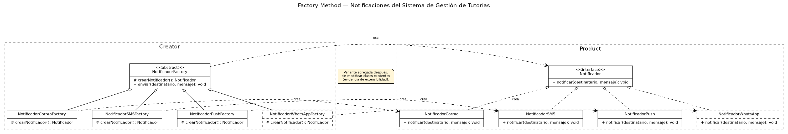
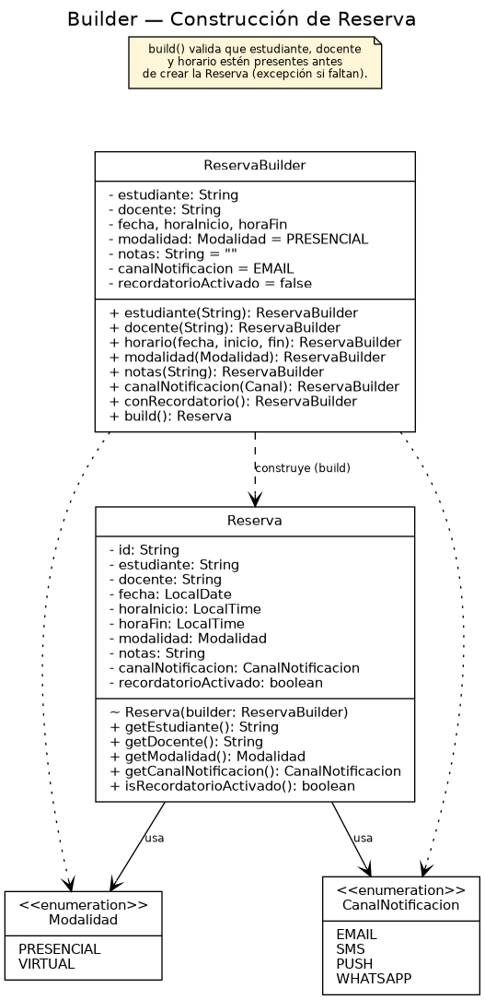

# Ae2 — Implementación comparativa de patrones de diseño

Factory Method y Builder aplicados al Sistema de gestión de tutorías.
Actividad evaluativa de la Semana 3 (Diseño de Software, UCOM0310).

## Propósito

Implementar y comparar los patrones creacionales **Factory Method** y
**Builder** sobre dos problemas concretos del Sistema de gestión de
tutorías: la creación de distintos mecanismos de notificación (Factory
Method) y la construcción de una `Reserva` con datos obligatorios y
opcionales (Builder), justificando técnicamente qué problema resuelve
cada patrón, cómo se representa en UML y cómo se traduce a Java.

## Caso base

El Sistema de gestión de tutorías requiere diferentes mecanismos de
notificación (correo, SMS, push y, más adelante, WhatsApp) y una
`Reserva` cuya configuración incluye datos obligatorios (estudiante,
docente, horario) y datos opcionales (modalidad, notas, canal de
notificación preferido, recordatorio).

## Clases principales y responsabilidades

### Parte A — Factory Method (`src/main/java/edu/uees/patrones/factory`)

| Clase / interfaz | Rol en el patrón | Responsabilidad |
|---|---|---|
| `Notificador` | Product | Contrato para notificar un evento a un destinatario. |
| `NotificadorCorreo`, `NotificadorSMS`, `NotificadorPush`, `NotificadorWhatsApp` | ConcreteProduct | Implementaciones concretas de notificación por canal. |
| `NotificadorFactory` | Creator | Declara el factory method `crearNotificador()` y el método plantilla `enviar()` que lo usa. |
| `NotificadorCorreoFactory`, `NotificadorSMSFactory`, `NotificadorPushFactory`, `NotificadorWhatsAppFactory` | ConcreteCreator | Deciden qué `Notificador` concreto instanciar. |
| `DemoFactoryMethod` | — | Demuestra la creación/uso de las variantes y la extensión con WhatsApp. |

### Parte B — Builder (`src/main/java/edu/uees/patrones/builder`)

| Clase | Responsabilidad |
|---|---|
| `Reserva` | Objeto inmutable con datos de la reserva; solo se construye a través de `ReservaBuilder`. |
| `ReservaBuilder` | Construye `Reserva` de forma progresiva con Fluent API, valores por defecto para los campos opcionales y validación de los campos obligatorios en `build()`. |
| `Modalidad`, `CanalNotificacion` | Enums usados por los campos opcionales de `Reserva`. |
| `DemoBuilder` | Demuestra dos configuraciones distintas de `Reserva` y la validación de campos obligatorios. |

El análisis completo (problema inicial de cada patrón, qué clases cambian
y cuáles permanecen estables, tabla comparativa y conclusiones) está en
[`docs/ANALISIS.md`](docs/ANALISIS.md).

## Diagramas UML

| Patrón | Fuente PlantUML | Imagen |
|---|---|---|
| Factory Method | [`docs/factory-method.puml`](docs/factory-method.puml) |  |
| Builder | [`docs/builder.puml`](docs/builder.puml) |  |

## Estructura del repositorio

```
semana3-patrones/
├── README.md
├── pom.xml
├── docs/
│   ├── ANALISIS.md
│   ├── factory-method.puml
│   ├── factory-method.png
│   ├── builder.puml
│   └── builder.png
└── src/
    ├── main/java/edu/uees/patrones/
    │   ├── App.java
    │   ├── factory/   (Notificador, ConcreteProducts, NotificadorFactory, ConcreteCreators, DemoFactoryMethod)
    │   └── builder/   (Reserva, ReservaBuilder, Modalidad, CanalNotificacion, DemoBuilder)
    └── test/java/edu/uees/patrones/
        ├── factory/NotificadorFactoryTest.java
        └── builder/ReservaBuilderTest.java
```

## Requisitos para ejecutar el proyecto

- Java 17 o superior.
- Maven 3.8 o superior.

## Comandos

```bash
# Compilar
mvn clean compile

# Compilar y ejecutar las pruebas unitarias (JUnit 5)
mvn clean test

# Ejecutar la demostración de consola (Factory Method + Builder)
mvn compile exec:java
```

## Declaración de uso de inteligencia artificial

Para esta actividad utilicé un asistente de inteligencia artificial
(Claude). La herramienta se empleó para generar el código Java inicial
de Factory Method y Builder, el `pom.xml`, los diagramas UML y este
README, a partir del caso base y los requisitos ya definidos en la guía
de la actividad. Revisé, probé (compilación y ejecución manual de los
escenarios cubiertos por las pruebas) y adapté el contenido generado, y
puedo explicar y justificar el código y las decisiones de diseño
presentadas.
