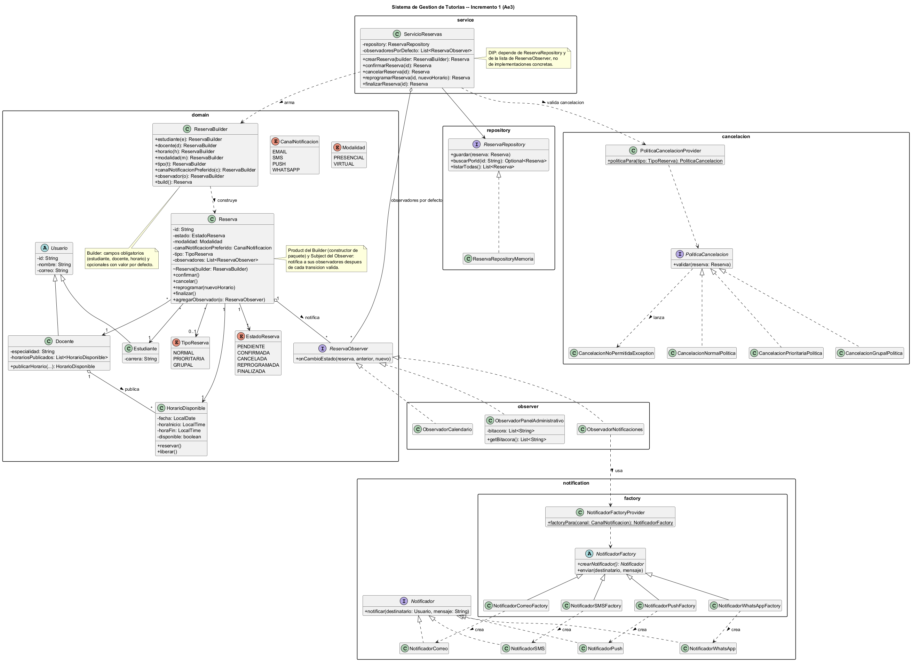

# Sistema de Gestión de Tutorías — Incremento 1 (Ae3)

Proyecto integrador de Diseño de Software (UCOM0310). Evoluciona el
diseño orientado a objetos de Ae1 y los patrones creacionales de Ae2
(Factory Method y Builder) integrándolos en un único proyecto, y
agrega dos patrones nuevos motivados por problemas reales del dominio:
**Strategy** (políticas de cancelación) y **Observer** (reacción a
cambios de estado de una reserva).

## Propósito

Publicar horarios, reservar tutorías, confirmarlas, cancelarlas,
reprogramarlas y finalizarlas, protegiendo las reglas del dominio
(un horario solo puede tener una reserva activa, las transiciones de
estado son explícitas) y permitiendo que la notificación de eventos y
la política de cancelación varíen sin modificar el flujo de
coordinación.

## Problema y alcance de este incremento

Hasta Ae2 el repositorio tenía dos árboles de código desconectados:
una demo aislada de Factory Method/Builder (`edu.uees.patrones`, sobre
un `Reserva` de juguete) y el dominio real de Ae1 (`edu.uees.tutorias`,
que ni usaba Builder ni Factory Method). Este incremento:

1. Retira `edu.uees.patrones` y reintegra Builder y Factory Method
   sobre el dominio real.
2. Agrega `TipoReserva` y una política de cancelación (**Strategy**)
   cuya antelación mínima varía según el tipo (normal, prioritaria,
   grupal).
3. Agrega **Observer**: `Reserva` notifica a sus observadores en cada
   cambio de estado, reemplazando las llamadas manuales que
   `ServicioReservas` hacía a `Notificador` después de cada operación.

El análisis completo (estado inicial, problemas identificados, tabla
de justificación de cada patrón, SOLID) está en
[`docs/INCREMENTO1.md`](docs/INCREMENTO1.md). El análisis original de
Ae2 se conserva en [`docs/ANALISIS.md`](docs/ANALISIS.md).

## Componentes principales

| Paquete | Clases / interfaces | Responsabilidad |
|---|---|---|
| `domain` | `Usuario`, `Estudiante`, `Docente`, `HorarioDisponible`, `Reserva`, `EstadoReserva` | Dominio y ciclo de vida de una reserva. |
| `domain` | `ReservaBuilder`, `Modalidad`, `CanalNotificacion`, `TipoReserva` | **Builder**: construye `Reserva` con campos obligatorios y opcionales. |
| `domain` | `ReservaObserver` | Contrato del **Observer**; `Reserva` es el Subject. |
| `notification` | `Notificador`, `NotificadorCorreo/SMS/Push/WhatsApp` | Canales de notificación (Product del Factory Method). |
| `notification.factory` | `NotificadorFactory` y sus `ConcreteCreator`, `NotificadorFactoryProvider` | **Factory Method**: elige el canal según la preferencia de la reserva. |
| `observer` | `ObservadorNotificaciones`, `ObservadorCalendario`, `ObservadorPanelAdministrativo` | ConcreteObserver: reaccionan a un cambio de estado sin conocerse entre sí. |
| `cancelacion` | `PoliticaCancelacion` y sus implementaciones, `PoliticaCancelacionProvider` | **Strategy**: antelación mínima para cancelar, según `TipoReserva`. |
| `repository` | `ReservaRepository`, `ReservaRepositoryMemoria` | Persistencia (DIP). |
| `service` | `ServicioReservas` | Coordina reserva, repositorio, política de cancelación y observadores por defecto. |

## Patrones utilizados y justificación (resumen)

| Patrón | Problema que resuelve | Se mantiene de Ae2 |
|---|---|---|
| Factory Method | Elegir la implementación de `Notificador` según el canal preferido, sin `if/else`. | Sí, ahora conectado a producción vía `ObservadorNotificaciones`. |
| Builder | Construir `Reserva` con datos obligatorios/opcionales sin constructor telescópico. | Sí, sobre el `Reserva` real; es la única forma de crearla. |
| Strategy *(nuevo)* | La antelación mínima para cancelar varía según el tipo de reserva. | — |
| Observer *(nuevo)* | Varios componentes deben reaccionar a un cambio de estado sin acoplar `ServicioReservas` a cada uno. | — |

Detalle completo (contexto, qué cambia, qué permanece estable, costo)
en [`docs/INCREMENTO1.md`](docs/INCREMENTO1.md#4-patrones-nuevos-incorporados-semana-4).

## Principios SOLID relevantes

- **SRP**: `Reserva` protege su ciclo de vida y avisa que cambió; no decide cómo se notifica ni si una cancelación es oportuna.
- **OCP**: nuevo canal → nueva `NotificadorFactory`; nuevo tipo de reserva → nueva `PoliticaCancelacion`; nuevo interesado → nuevo `ReservaObserver`. Ninguno modifica código existente.
- **DIP**: `ServicioReservas(ReservaRepository, List<ReservaObserver>)` depende de abstracciones.

## Diagrama UML

Fuente: [`docs/uml-incremento1.puml`](docs/uml-incremento1.puml) ·
Imagen: 

(Diagramas históricos de Ae2: [`docs/factory-method.puml`](docs/factory-method.puml), [`docs/builder.puml`](docs/builder.puml).)

## Estructura del repositorio

```
Sistemas_Tutorias/
├── README.md
├── pom.xml
├── docs/
│   ├── INCREMENTO1.md          (analisis de Ae3)
│   ├── ANALISIS.md             (analisis historico de Ae2)
│   ├── uml-incremento1.puml / .png
│   └── factory-method.*, builder.*, modelo-clases.*  (historicos)
└── src/
    ├── main/java/edu/uees/tutorias/
    │   ├── App.java
    │   ├── domain/          (entidades, Builder, Observer)
    │   ├── notification/    (Notificador + factory/ Factory Method)
    │   ├── observer/        (ConcreteObserver)
    │   ├── cancelacion/     (Strategy)
    │   ├── repository/
    │   └── service/
    └── test/java/edu/uees/tutorias/
        ├── domain/ReservaBuilderTest.java
        ├── notification/factory/NotificadorFactoryTest.java
        ├── cancelacion/PoliticaCancelacionTest.java
        └── service/ServicioReservasTest.java
```

## Requisitos para ejecutar el proyecto

- Java 17 o superior.
- Maven 3.8 o superior.

## Comandos

```bash
# Compilar
mvn clean compile

# Compilar y ejecutar las pruebas unitarias (JUnit 5)
mvn clean test

# Ejecutar la demostracion de consola (Builder + Factory Method + Strategy + Observer)
mvn compile exec:java
```

## Declaración de uso de inteligencia artificial

Para esta actividad utilicé un asistente de inteligencia artificial
(Claude). La herramienta se empleó para integrar el código de Ae2
sobre el dominio de Ae1, generar el código Java de los patrones
Strategy y Observer, el diagrama UML y la redacción de este README y
de `docs/INCREMENTO1.md`, a partir de los requisitos de la guía de
Ae3. Revisé, probé (`mvn clean test` y `mvn compile exec:java`,
incluidos en este documento) y adapté el contenido generado, y puedo
explicar y justificar el código y las decisiones de diseño
presentadas.
