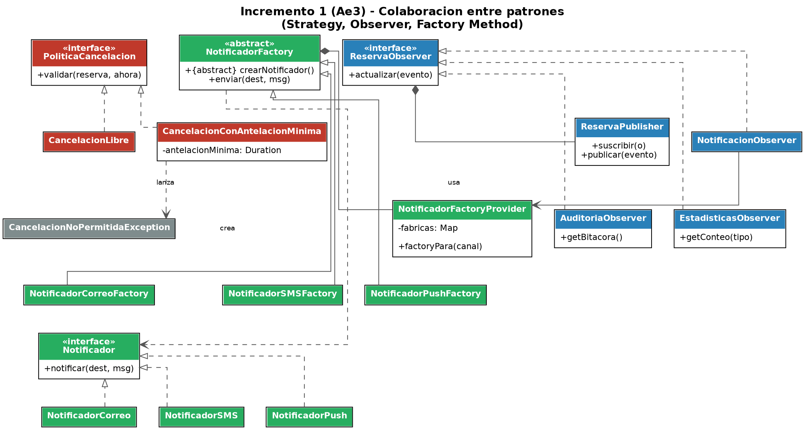

# Sistema de Gestión de Tutorías

Modelo orientado a objetos, en Java/Maven, de un sistema que coordina la
solicitud y gestión de tutorías académicas entre estudiantes y docentes.
El proyecto se construye de forma incremental a lo largo del curso de
Diseño de Software (UEES UCOM0310):

- **Ae1** — Análisis de dominio, diseño OO y primera versión del código.
- **Ae2** — Se identifican y aplican los patrones creacionales **Factory
  Method** y **Builder** sobre el mismo proyecto.
- **Ae3 (incremento 1, este documento)** — Se recupera todo lo anterior y
  se incorporan los patrones **Strategy** y **Observer** para resolver dos
  problemas de diseño reales que aparecieron al crecer el sistema. Ver la
  sección [Patrones utilizados](#patrones-utilizados-y-justificación) más
  abajo para el detalle de qué se mantuvo, qué cambió y por qué.

## Descripción del problema y alcance del incremento

El dominio está compuesto por estudiantes que solicitan tutorías, docentes
que publican horarios disponibles y reservas que representan el encuentro
entre ambos. El sistema debe permitir:

- que un estudiante pueda tener múltiples reservas;
- que un horario solo pueda estar ocupado por una reserva a la vez;
- que no se pueda reservar un horario que ya está ocupado;
- que una reserva pendiente pueda confirmarse, cancelarse o reprogramarse;
- que una reserva confirmada pueda finalizarse;
- que los usuarios reciban comunicación de los eventos relevantes, por el
  canal que cada uno prefiera (correo, SMS o push);
- que una reserva pueda registrar datos opcionales (modalidad, notas,
  canal de notificación, recordatorio) sin obligar a indicarlos todos;
- que cancelar una tutoría respete una política de antelación mínima, en
  lugar de permitirse siempre;
- que distintos interesados (notificaciones, auditoría, estadísticas)
  puedan reaccionar a los mismos eventos de una reserva sin acoplarse
  entre sí ni con `ServicioReservas`;
- que la información se pueda persistir sin acoplar el dominio a una
  tecnología de almacenamiento específica.

Los primeros cuatro puntos y la persistencia ya estaban resueltos desde
Ae1. Este incremento agrega los últimos cuatro: campos opcionales de
`Reserva` (Builder, recuperado de Ae2), selección de canal de notificación
(Factory Method, recuperado y reforzado de Ae2), política de cancelación
configurable (Strategy, nuevo) y desacoplo de quién reacciona a un evento
de reserva (Observer, nuevo).

## Clases y componentes principales

| Paquete | Clase / interfaz | Responsabilidad |
|---|---|---|
| `domain` | `Usuario` (abstracta) | Datos comunes de estudiantes y docentes (id, nombre, correo). |
| `domain` | `Estudiante`, `Docente` | Especializaciones de `Usuario`. `Docente` además publica `HorarioDisponible`. |
| `domain` | `HorarioDisponible` | Franja horaria; protege su disponibilidad (`reservar()`/`liberar()`). |
| `domain` | `EstadoReserva`, `Modalidad`, `CanalNotificacion`, `TipoEvento` | Enums que acotan los valores válidos de estado, modalidad, canal y tipo de evento. |
| `domain` | `Reserva` | Encuentro estudiante–docente–horario; controla sus propias transiciones de estado (`confirmar`, `cancelar`, `reprogramar`, `finalizar`). Se construye únicamente a través de `ReservaBuilder`. |
| `domain` | `ReservaBuilder` | **Builder** (Ae2, recuperado): arma una `Reserva` con 3 campos obligatorios y 4 opcionales con valores por defecto, validando antes de construir. |
| `domain` | `ReservaEvento` | Evento inmutable (tipo + reserva + instante) publicado ante cada cambio de estado. |
| `service` | `ServicioReservas` | Orquesta el caso de uso; no valida reglas de estado, no persiste, no decide si una cancelación es oportuna ni quién debe enterarse de un cambio — delega todo eso en sus colaboradores. |
| `repository` | `ReservaRepository` / `ReservaRepositoryMemoria` | Contrato de persistencia y su implementación en memoria. |
| `strategy` | `PoliticaCancelacion` (interfaz) | **Strategy** (nuevo): contrato para decidir si una cancelación es válida. |
| `strategy` | `CancelacionLibre`, `CancelacionConAntelacionMinima` | Variantes concretas de la política: sin restricción, y con antelación mínima configurable. |
| `observer` | `ReservaObserver` (interfaz) / `ReservaPublisher` | **Observer** (nuevo): contrato de suscriptor y Subject que reparte cada `ReservaEvento` a todos sus suscriptores. |
| `observer` | `NotificacionObserver`, `AuditoriaObserver`, `EstadisticasObserver` | Suscriptores concretos: envía notificaciones (usando Factory Method), registra una bitácora y lleva un conteo por tipo de evento. |
| `notification` | `NotificadorFactory` (abstracta) + `NotificadorCorreoFactory`/`SMS`/`Push` | **Factory Method** (Ae2, recuperado y reforzado): una fábrica por canal de notificación. |
| `notification` | `NotificadorFactoryProvider` | Registro de fábricas por `CanalNotificacion`, usado por `NotificacionObserver` para elegir la fábrica según el canal preferido de cada reserva. |
| `notification` | `Notificador` (interfaz) + `NotificadorCorreo`/`SMS`/`Push` | Productos del Factory Method: el objeto que efectivamente notifica. |

Estructura de paquetes:

```
sistema-tutorias/
├── pom.xml
├── README.md
├── docs/
│   ├── modelo-clases.puml / .png              (Ae1: dominio base)
│   ├── uml-incremento1.puml / .png            (Ae3: vista general del incremento)
│   ├── uml-incremento1-patrones.puml / .png   (Ae3: Strategy + Observer + Factory Method)
│   └── verificacion-ae3.txt                   (evidencia de verificación manual, ver mas abajo)
└── src/
    ├── main/java/edu/uees/tutorias/
    │   ├── App.java                (composition root / demo de consola)
    │   ├── domain/         (Usuario, Estudiante, Docente, HorarioDisponible, Reserva,
    │   │                     ReservaBuilder, ReservaEvento, EstadoReserva, Modalidad,
    │   │                     CanalNotificacion, TipoEvento)
    │   ├── service/         (ServicioReservas)
    │   ├── strategy/        (PoliticaCancelacion, CancelacionLibre,
    │   │                     CancelacionConAntelacionMinima, CancelacionNoPermitidaException)
    │   ├── observer/        (ReservaObserver, ReservaPublisher, NotificacionObserver,
    │   │                     AuditoriaObserver, EstadisticasObserver)
    │   ├── notification/    (Notificador y ConcreteProducts, NotificadorFactory y
    │   │                     ConcreteCreators, NotificadorFactoryProvider)
    │   └── repository/      (ReservaRepository, ReservaRepositoryMemoria)
    └── test/java/edu/uees/tutorias/
        ├── domain/ReservaBuilderTest.java
        ├── strategy/PoliticaCancelacionTest.java
        ├── observer/ReservaPublisherTest.java
        └── service/ServicioReservasTest.java
```

## Patrones utilizados y justificación

### Recuperados de Ae2

**Factory Method** (paquete `notification`) sigue justificado en este
incremento: en Ae2 ya existía para no acoplar `ServicioReservas` a una
implementación concreta de `Notificador`. En Ae3 el problema creció —
ahora cada `Reserva` elige su propio `CanalNotificacion` (EMAIL, SMS,
PUSH) — así que se agregó `NotificadorFactoryProvider`, que registra una
`NotificadorFactory` por canal y elige la correcta en tiempo de ejecución.
El patrón pasó de "una fábrica fija" a "una fábrica por canal
seleccionable", resolviendo un problema real (canales de notificación
crecientes) sin tocar `Notificador` ni sus implementaciones.

**Builder** (`ReservaBuilder`) también sigue justificado: en Ae1, `Reserva`
tenía 3 campos, todos obligatorios, y un constructor simple alcanzaba.
Este incremento agrega `modalidad`, `notas`, `canalNotificacion` y
`recordatorioActivado` — la mayoría opcionales con valor por defecto —, lo
que habría obligado a un constructor con múltiples sobrecargas o a repetir
valores por defecto en cada llamada. El Builder resuelve ese problema real
de construcción sin ensuciar el resto del dominio.

### Nuevos en Ae3 (incremento 1)

| | Problema real | Patrón | Clases/interfaces implicadas | Principio SOLID | Cómo se verificó |
|---|---|---|---|---|---|
| **Patrón 1** | Las reglas para cancelar una tutoría dejaron de ser fijas: al inicio cualquier cancelación era libre, pero se necesita poder exigir una antelación mínima (y, a futuro, otras reglas) sin si-elses acumulados en `ServicioReservas`. | **Strategy** | `PoliticaCancelacion` (interfaz), `CancelacionLibre`, `CancelacionConAntelacionMinima`, `CancelacionNoPermitidaException` | OCP: agregar una política nueva no exige tocar `ServicioReservas` ni las políticas existentes. | `PoliticaCancelacionTest` (unitario, 3 casos) y `ServicioReservasTest.politicaDeCancelacionConAntelacionMinimaRechazaCancelacionTardia`; además el flujo de `App.java` fuerza una cancelación tardía y muestra el mensaje de rechazo. |
| **Patrón 2** | Correo, auditoría y estadísticas necesitaban enterarse de cada cambio de una reserva, y antes lo resolvían llamadas directas dentro de `ServicioReservas` (que crecía cada vez que se agregaba un interesado nuevo y mezclaba responsabilidades ajenas al caso de uso). | **Observer** | `ReservaObserver` (interfaz), `ReservaPublisher` (Subject), `NotificacionObserver`, `AuditoriaObserver`, `EstadisticasObserver`, `ReservaEvento`/`TipoEvento` | SRP: `ServicioReservas` ya no sabe quién reacciona a un evento ni cómo; solo publica. OCP: agregar un observer nuevo (p. ej. un panel web) no requiere tocar `ServicioReservas`. | `ReservaPublisherTest` (unitario, 3 casos) y todos los tests de `ServicioReservasTest` (verifican que se publique al menos un evento); `App.java` imprime la bitácora y las estadísticas acumuladas al final de la demo. |

### Por qué NO se usaron Adapter ni Facade

El listado de la semana 4 también incluía Adapter y Facade, pero no se
incorporaron porque no resuelven un problema presente en este incremento:

- **Adapter** existe para conciliar una interfaz externa incompatible con
  la que el dominio espera (p. ej. un proveedor de correo de terceros con
  su propio SDK). Este incremento no integra ningún servicio externo con
  una interfaz distinta a la propia — `Notificador` ya es la abstracción
  que necesitamos y las tres implementaciones actuales la satisfacen
  directamente. Agregar un Adapter aquí sería resolver un problema que no
  existe.
- **Facade** existe para simplificar el acceso a un subsistema con muchas
  piezas internas. `ServicioReservas` ya cumple ese rol de punto de
  entrada único y, tras mover las notificaciones a `NotificacionObserver`,
  es *más* simple que en Ae2 (menos dependencias, no más). Envolverlo en
  una fachada adicional agregaría una capa sin beneficio real.

Esta decisión sigue el criterio explícito de la actividad: no se obtiene
mejor diseño por usar más patrones, sino por usar los que resuelven un
problema real y dejar fuera los que no.

## Principios SOLID, cohesión y acoplamiento

- **SRP:** cada clase tiene un motivo de cambio. `Reserva` cambia si
  cambian las reglas de su propio ciclo de vida; `PoliticaCancelacion`
  cambia si cambian las reglas de cancelación; `ReservaObserver` y sus
  implementaciones cambian si cambia qué se hace con un evento;
  `ServicioReservas` cambia solo si cambia la orquestación del caso de
  uso. Antes de este incremento, `ServicioReservas` mezclaba orquestación
  con la decisión de a quién notificar y cómo; ahora esa responsabilidad
  se movió por completo a `NotificacionObserver`.
- **OCP:** tanto `PoliticaCancelacion` como `ReservaObserver` y
  `NotificadorFactory` son puntos de extensión: se agregan
  implementaciones nuevas sin modificar el código que ya funciona
  (`ServicioReservas`, `ReservaPublisher`, `NotificadorFactoryProvider`).
- **LSP:** cualquier `PoliticaCancelacion`, `ReservaObserver` o
  `Notificador` puede sustituir a otro sin romper a quien lo usa; así se
  aprovecha directamente en las pruebas (observers y políticas de prueba
  en memoria).
- **DIP:** `ServicioReservas(ReservaRepository, ReservaPublisher,
  PoliticaCancelacion)` depende únicamente de abstracciones inyectadas
  por constructor. `App.java` es el único lugar que conoce todas las
  implementaciones concretas a la vez (composition root).
- **Cohesión y acoplamiento:** el cambio más notorio del incremento es que
  **introducir un patrón (Observer) redujo el acoplamiento de
  `ServicioReservas`** en vez de aumentarlo — antes dependía de
  `Notificador` directamente, ahora ya no depende de él en absoluto (ver
  `service/ServicioReservas.java`, javadoc de la clase).

## Diagramas UML

- Dominio base (Ae1): [`docs/modelo-clases.puml`](docs/modelo-clases.puml) / [`docs/modelo-clases.png`](docs/modelo-clases.png)
- Vista general del incremento 1 (Ae3): [`docs/uml-incremento1.puml`](docs/uml-incremento1.puml) / [`docs/uml-incremento1.png`](docs/uml-incremento1.png)
- Colaboración entre Strategy, Observer y Factory Method: [`docs/uml-incremento1-patrones.puml`](docs/uml-incremento1-patrones.puml) / [`docs/uml-incremento1-patrones.png`](docs/uml-incremento1-patrones.png)




## Requisitos para ejecutar el proyecto

- Java 17 o superior.
- Maven 3.8 o superior.

## Comandos

```bash
# Compilar
mvn clean compile

# Compilar y ejecutar las pruebas unitarias (JUnit 5)
mvn clean test

# Ejecutar la demostración de consola (App.main)
mvn compile exec:java
```

> Nota de verificación: en el entorno donde se preparó este incremento no
> hubo acceso a Maven Central, por lo que la compilación y las pruebas se
> verificaron de forma equivalente con `javac`/`java` y un smoke test ad
> hoc que reproduce los mismos escenarios que las clases de prueba JUnit
> (ver `docs/verificacion-ae3.txt`). Con acceso normal a internet, los
> comandos `mvn` de arriba son la vía estándar y deberían ejecutarse sin
> pasos adicionales.

## Declaración de uso de inteligencia artificial

Se utilizó un asistente de inteligencia artificial (Claude) como apoyo
para generar el código Java de este incremento (Strategy, Observer y la
extensión del Builder/Factory Method), el `pom.xml`, los diagramas UML y
este `README.md`, a partir del análisis de los problemas de diseño y del
trabajo previo de Ae1/Ae2 (dominio, patrones ya identificados y
decisiones de cohesión/acoplamiento/SOLID). El estudiante es responsable
de comprender, verificar, probar y justificar todo el contenido y código
presentado, y de adaptarlo según el criterio del docente.
