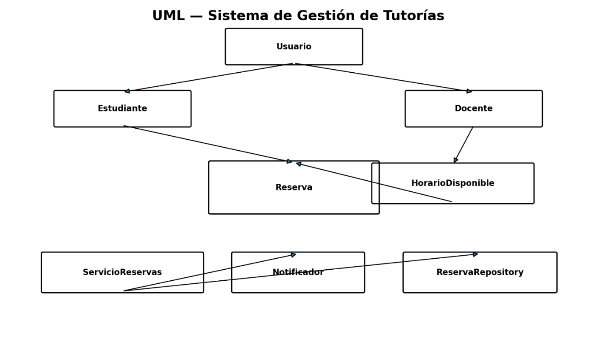

# Sistema de Gestión de Tutorías

Modelo orientado a objetos, en Java/Maven, de un sistema que coordina la
solicitud y gestión de tutorías académicas entre estudiantes y docentes.
Implementa la Actividad 5 (Análisis y diseño orientado a objetos) del curso
de Programación Orientada a Objetos.

## Descripción del problema

El dominio está compuesto por estudiantes que solicitan tutorías, docentes
que publican horarios disponibles y reservas que representan el encuentro
entre ambos. El sistema debe permitir:

- que un estudiante pueda tener múltiples reservas;
- que un horario solo pueda estar ocupado por una reserva a la vez;
- que no se pueda reservar un horario que ya está ocupado;
- que una reserva pendiente pueda confirmarse, cancelarse o reprogramarse;
- que una reserva confirmada pueda finalizarse;
- que los usuarios reciban comunicación de los eventos relevantes;
- que la información se pueda persistir sin acoplar el dominio a una
  tecnología de almacenamiento específica.

## Clases principales y responsabilidades

| Clase / interfaz | Responsabilidad |
|---|---|
| `Usuario` (abstracta) | Representar la información común de estudiantes y docentes (id, nombre, correo). |
| `Estudiante` | Especialización de `Usuario` que solicita tutorías; agrega `carrera`. |
| `Docente` | Especialización de `Usuario` que publica y administra horarios disponibles; agrega `especialidad`. |
| `HorarioDisponible` | Representar una franja horaria y proteger su disponibilidad (`reservar()` / `liberar()`). |
| `EstadoReserva` | Enum con los estados válidos del ciclo de vida de una reserva. |
| `Reserva` | Registrar el encuentro estudiante–docente–horario y controlar las transiciones de estado (`confirmar`, `cancelar`, `reprogramar`, `finalizar`). |
| `ServicioReservas` | Coordinar el proceso de reserva; no persiste datos ni envía notificaciones directamente, delega en sus colaboradores. |
| `Notificador` (interfaz) | Contrato para comunicar eventos importantes a un usuario. |
| `NotificadorCorreo` | Implementación de `Notificador` que simula el envío de un correo. |
| `ReservaRepository` (interfaz) | Contrato de persistencia de reservas. |
| `ReservaRepositoryMemoria` | Implementación de `ReservaRepository` en memoria, usada para pruebas y ejecución local. |

Estructura de paquetes:

```
sistema-tutorias/
├── pom.xml
├── README.md
├── docs/
│   ├── modelo-clases.puml
│   └── modelo-clases.png
└── src/
    ├── main/java/edu/uees/tutorias/
    │   ├── App.java
    │   ├── domain/        (Usuario, Estudiante, Docente, HorarioDisponible, Reserva, EstadoReserva)
    │   ├── service/        (ServicioReservas)
    │   ├── notification/   (Notificador, NotificadorCorreo)
    │   └── repository/     (ReservaRepository, ReservaRepositoryMemoria)
    └── test/java/edu/uees/tutorias/service/
        └── ServicioReservasTest.java
```

## Decisiones de diseño relevantes

- **Encapsulación:** todos los atributos son privados. `HorarioDisponible`
  solo cambia su disponibilidad a través de `reservar()`/`liberar()`, y
  `Reserva` valida cada transición de estado antes de aplicarla, en lugar
  de exponer un setter de estado.
- **Herencia con propósito:** `Usuario` es la abstracción común y
  `Estudiante`/`Docente` son especializaciones porque ambos son usuarios
  del sistema con comportamiento propio (no se usa herencia solo para
  reutilizar código).
- **Composición y asociación:** `Docente` es dueño del ciclo de vida de los
  horarios que publica (composición). `Reserva` referencia a estudiante,
  docente y horario porque colabora con ellos, pero no los "es"
  (asociación, no herencia).
- **Sin atributos bidireccionales innecesarios:** `Estudiante` no mantiene
  una lista interna de reservas; esa consulta se resuelve a través de
  `ReservaRepository.listarPorEstudiante(...)`, evitando duplicar el
  estado y mantener sincronizadas dos colecciones.
- **Bajo acoplamiento:** `ServicioReservas` recibe `ReservaRepository` y
  `Notificador` como abstracciones por constructor. Cambiar de correo a
  SMS, o de memoria a una base de datos, no exige modificar la lógica de
  coordinación.
- **Responsabilidades fuera de `Reserva`:** deliberadamente no se agregan
  métodos como `enviarCorreo()`, `guardarEnBaseDatos()` o
  `generarReporte()` dentro de `Reserva`, porque introducirían
  responsabilidades ajenas a su estado y aumentarían el acoplamiento.

## Principios SOLID aplicados

- **SRP (Single Responsibility):** `Reserva` controla su propio estado;
  `ServicioReservas` coordina el caso de uso; `Notificador` se encarga solo
  de comunicar; `ReservaRepository` se encarga solo de persistir.
- **OCP (Open/Closed):** `Notificador` y `ReservaRepository` son
  interfaces; se pueden agregar nuevas implementaciones (`NotificadorSMS`,
  `ReservaRepositoryJdbc`, etc.) sin modificar `ServicioReservas`.
- **DIP (Dependency Inversion):** `ServicioReservas(ReservaRepository
  repository, Notificador notificador)` depende de abstracciones, no de
  implementaciones concretas; las implementaciones se inyectan por
  constructor (ver `App.java`).
- **LSP:** cualquier implementación de `Notificador` o `ReservaRepository`
  puede sustituir a otra sin alterar el comportamiento esperado por
  `ServicioReservas` (así se aprovecha en las pruebas, donde se usa un
  `Notificador` de prueba en memoria).

## Diagrama UML

El diagrama de clases está disponible en dos formatos:

- Fuente editable en PlantUML: [`docs/modelo-clases.puml`](docs/modelo-clases.puml)
- Imagen: [`docs/modelo-clases.png`](docs/modelo-clases.png)



## Requisitos para ejecutar el proyecto

- Java 17 o superior.
- Maven 3.8 o superior.

## Comandos

```bash
# Compilar
mvn clean compile

# Compilar y ejecutar las pruebas unitarias (JUnit 5)
mvn clean test

# Ejecutar la demostración de consola (App.main)
mvn compile exec:java
```

## Declaración de uso de inteligencia artificial

Se utilizó un asistente de inteligencia artificial (Claude) como apoyo para
generar el andamiaje inicial del código Java, el `pom.xml` y este
`README.md` a partir del análisis de dominio y del diseño ya documentados
en el trabajo previo (identificación de clases, responsabilidades, reglas
de negocio y decisiones de cohesión/acoplamiento/SOLID). El estudiante es
responsable de comprender, verificar, probar y justificar todo el
contenido y código presentado, y de adaptarlo según el criterio del
docente.
